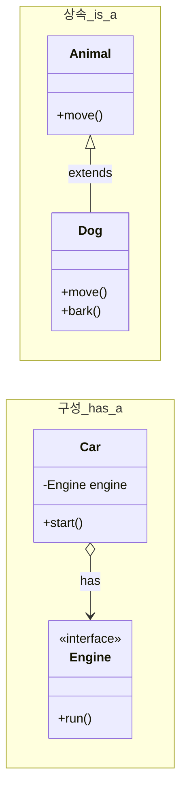
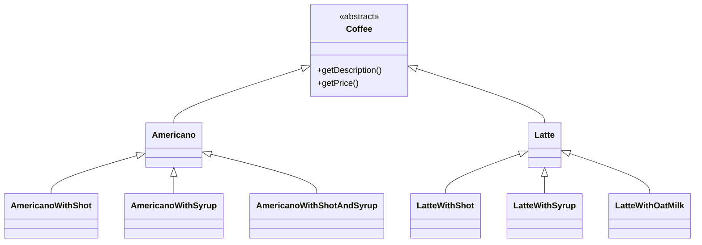
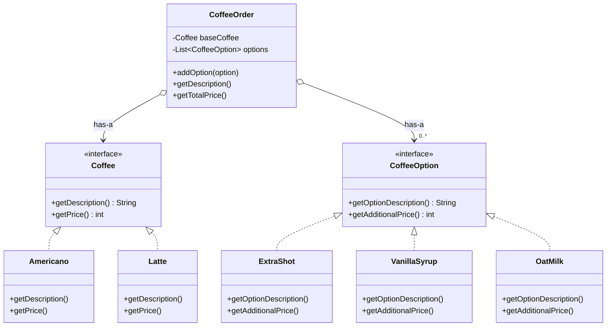
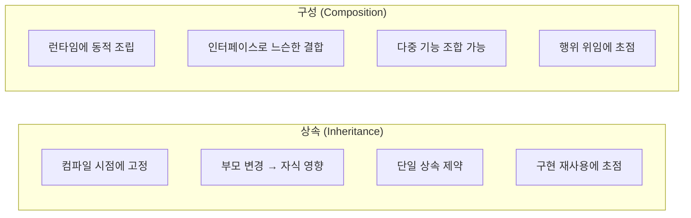
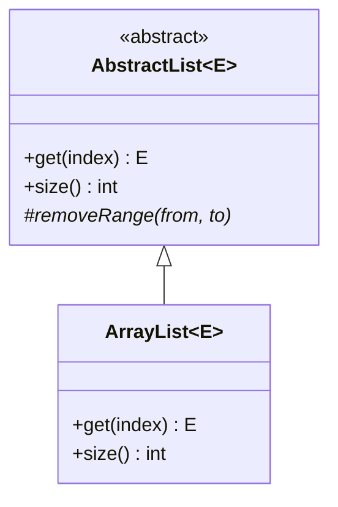
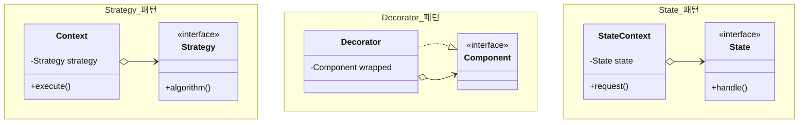

# 상속보다 구성을 활용하라 (Favor Composition over Inheritance)

GoF(Gang of Four) 디자인 패턴 책에서 강조된 핵심 설계 원칙입니다. 많은 디자인 패턴들이 이 원칙을 기반으로 설계되었습니다.

---

## 핵심 개념

**상속(Inheritance)** 은 "is-a" 관계를 표현합니다. `Dog is an Animal`처럼 자식이 부모의 한 종류임을 나타냅니다. 컴파일 시점에 관계가 고정되며, 부모의 구현을 그대로 물려받습니다.

**구성(Composition)** 은 "has-a" 관계를 표현합니다. `Car has an Engine`처럼 객체가 다른 객체를 포함하여 기능을 위임합니다. 런타임에 동적으로 조립할 수 있습니다.



---

## 상속의 문제점

### 문제 1: 클래스 폭발

커피숍에서 커피(아메리카노, 라떼)와 옵션(샷추가, 시럽)을 상속으로 표현하면 조합의 수만큼 클래스가 필요합니다.



> ⚠️ 커피 2종 × 옵션 조합 = 클래스 폭발! 새 옵션 추가 시 모든 커피에 적용 필요

### 문제 2: 깨지기 쉬운 기반 클래스 (Fragile Base Class)

부모 클래스의 변경이 예상치 못한 방식으로 자식에게 영향을 미칩니다.

```java
// 부모 클래스가 변경되면 자식이 깨질 수 있음
class CustomSet<E> extends HashSet<E> {
    private int addCount = 0;

    @Override
    public boolean addAll(Collection<? extends E> c) {
        addCount += c.size();
        return super.addAll(c);  // 내부적으로 add()를 호출 → 중복 카운트!
    }
}
```

### 문제 3: 캡슐화 파괴

자식 클래스가 부모의 내부 구현에 의존하게 되어, 부모를 자유롭게 수정할 수 없습니다.

---

## 구성으로 해결

### 해결된 구조



> ✅ 구성을 사용하면: 런타임에 옵션 조합 가능, 새 옵션 추가가 쉬움, 기존 코드 수정 불필요

### 구현 코드

```java
// 핵심: 상속 대신 인터페이스와 구성 사용
class CoffeeOrder {
    private final Coffee baseCoffee;          // has-a 관계
    private final List<CoffeeOption> options; // has-a 관계

    public CoffeeOrder addOption(CoffeeOption option) {
        options.add(option);
        return this;
    }

    public int getTotalPrice() {
        return baseCoffee.getPrice() +
               options.stream().mapToInt(CoffeeOption::getAdditionalPrice).sum();
    }
}
```

```java
// 사용: 런타임에 자유롭게 조합
CoffeeOrder order = new CoffeeOrder(new Latte())
                .addOption(new ExtraShot())
                .addOption(new OatMilk());
```

---

## 상속 vs 구성 비교



| 관점    | 상속       | 구성       |
|-------|----------|----------|
| 결합 시점 | 컴파일 타임   | 런타임      |
| 유연성   | 낮음       | 높음       |
| 캡슐화   | 파괴됨      | 보존됨      |
| 확장 방식 | 새 클래스 생성 | 새 구현체 주입 |

---

## 언제 상속을 사용하는가

상속이 적절한 경우도 있습니다.

**적절한 상속의 조건:**

1. 진정한 is-a 관계일 때 (정사각형은 직사각형인가? → 아님!)
2. 부모 클래스가 확장을 목적으로 설계되었을 때
3. 자식이 리스코프 치환 원칙(LSP)을 준수할 때



> ✅ 프레임워크 설계자가 확장을 목적으로 만든 추상 클래스는 상속에 적합

---

## 관련 디자인 패턴

이 원칙을 이해하면 다음 패턴들이 자연스럽게 이해됩니다.



| 패턴        | 구성 활용 방식                  |
|-----------|---------------------------|
| Strategy  | 알고리즘을 별도 객체로 분리하여 교체 가능하게 |
| Decorator | 기능을 감싸는 객체로 동적 추가         |
| State     | 상태별 행위를 별도 객체로 분리         |
| Bridge    | 추상화와 구현을 분리하여 독립적 확장      |

---

## 핵심 정리

> "일단 구성을 먼저 고려하고, 정말 필요할 때만 상속을 사용하라"

구성은 더 유연하고, 캡슐화를 보존하며, 변화에 강한 설계를 가능하게 합니다. 상속은 코드 재사용의 쉬운 방법처럼 보이지만, 장기적으로는 구성이 더 나은 선택인 경우가 많습니다.