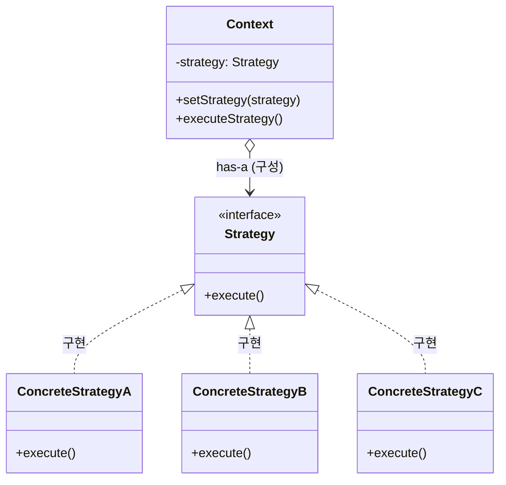
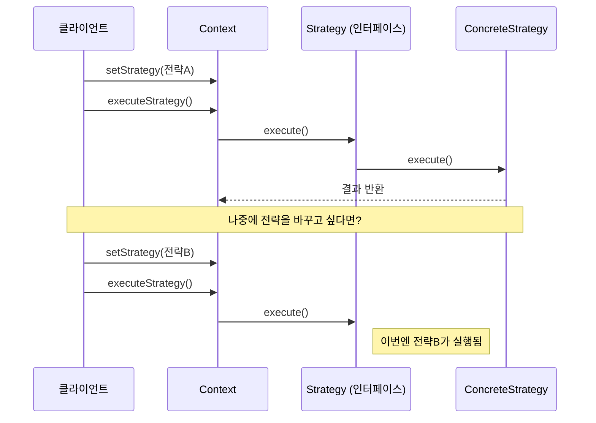
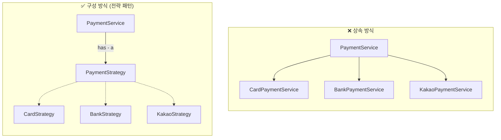
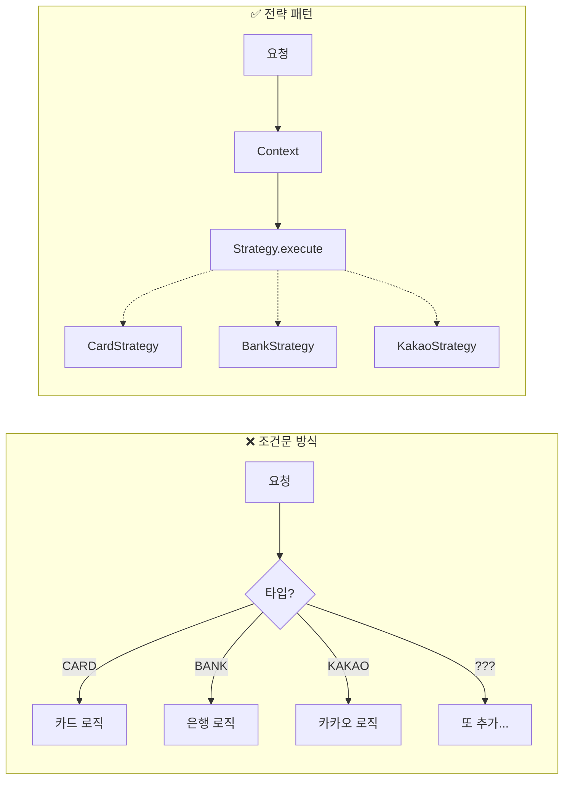
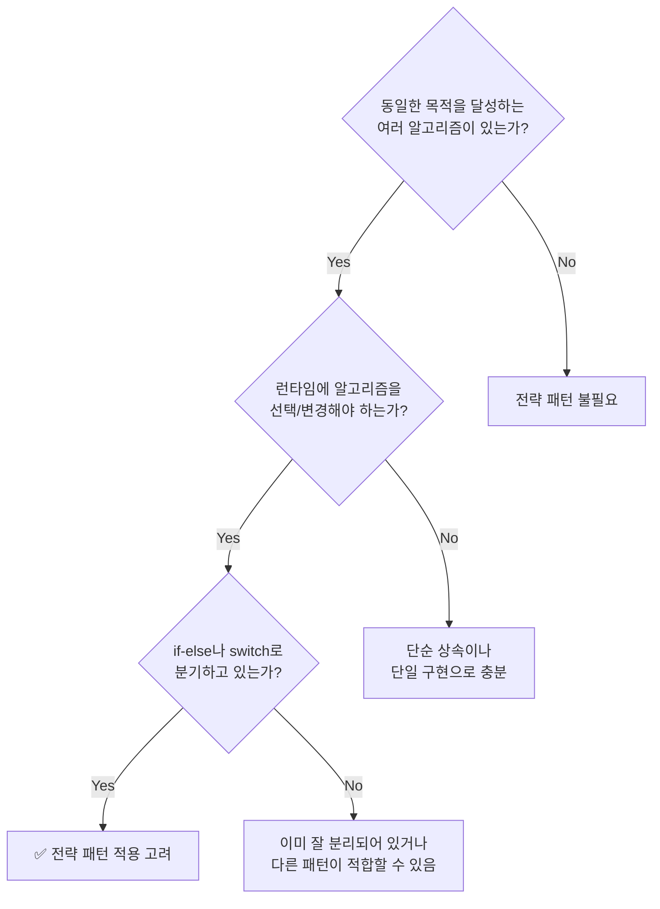
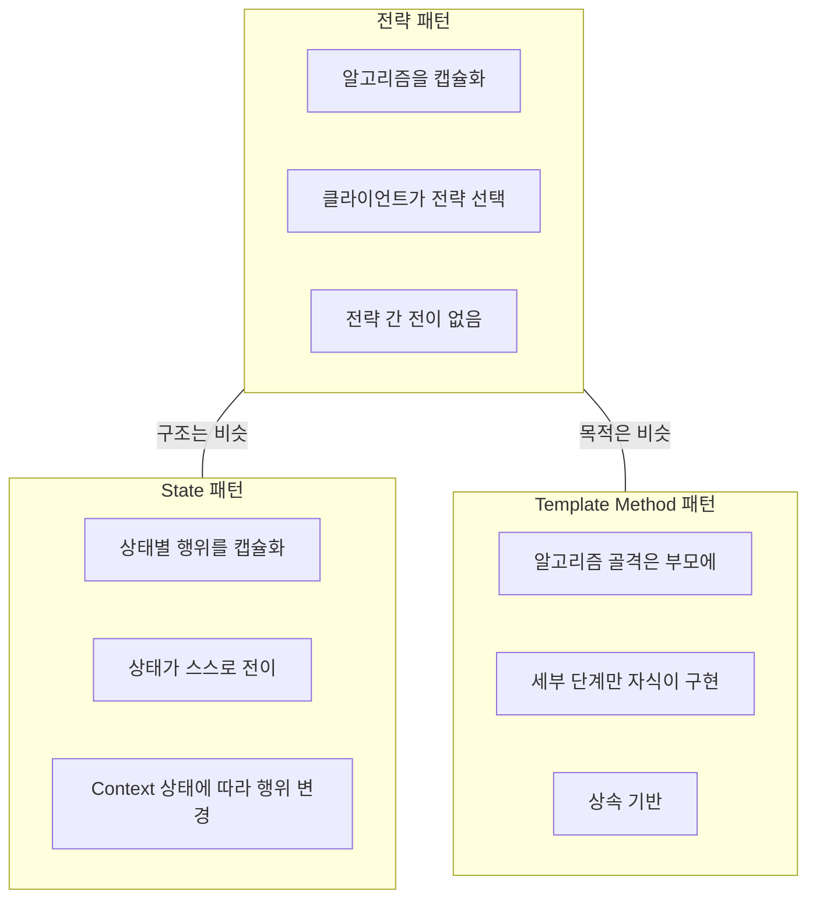

# 전략 패턴 (Strategy Pattern)

GoF 디자인 패턴 중 **행위(Behavioral) 패턴**에 속합니다. "상속보다 구성" 원칙이 가장 직관적으로 적용된 패턴입니다.

---

## 정의

> 알고리즘 군을 정의하고, 각각을 캡슐화하여, 상호 교환 가능하게 만든다. 전략 패턴을 사용하면 알고리즘을 사용하는 클라이언트와 독립적으로 알고리즘을 변경할 수 있다.

핵심 아이디어는 **"변하는 부분(알고리즘)을 찾아서 캡슐화하고, 교체 가능하게 만든다"** 는 것입니다. "전략(Strategy)"이라는 이름은 목표를 달성하기 위한 여러 방법 중 하나를 선택한다는 의미에서
붙었습니다.

---

## 패턴의 구조

| 구성 요소                | 역할                                                   |
|----------------------|------------------------------------------------------|
| **Context**          | 전략을 사용하는 주체. 전략 객체를 "가지고(has-a)" 있으며, 실제 작업은 전략에게 위임 |
| **Strategy**         | 모든 전략이 따라야 할 계약(인터페이스). Context는 이 인터페이스만 알면 됨       |
| **ConcreteStrategy** | 실제 알고리즘을 구현한 클래스들. 각자 자신만의 방식으로 Strategy 인터페이스를 구현   |

---

## 동작 흐름

클라이언트가 원하는 전략을 Context에 주입하면, Context는 그 전략에게 작업을 위임합니다. 다른 전략으로 바꾸고 싶으면 `setStrategy()`로 교체하면 되고, Context의 코드는 전혀 바뀌지
않습니다.

---

## 구성(Composition) 원칙과의 연결

"상속보다 구성" 원칙이 전략 패턴에서 이렇게 적용됩니다.

| 방식      | 특징                                       |
|---------|------------------------------------------|
| 상속      | 결제 수단마다 서브클래스 필요. **컴파일 시점**에 클래스 결정     |
| 구성 (전략) | 전략 객체를 **가지고(has-a)** 있음. **런타임**에 교체 가능 |

---

## 조건문 vs 전략 패턴

| 조건문 방식                 | 전략 패턴            |
|------------------------|------------------|
| 새 타입 추가 시 **기존 코드 수정** | 새 전략 클래스 **추가만** |
| if-else가 점점 길어짐        | 조건문 없음           |
| 한 클래스가 모든 로직을 앎        | 각 전략이 자신의 로직만 담당 |
| OCP 위반                 | OCP 준수           |

---

## 언제 사용하는가

**적합한 상황:**

- 같은 목적을 달성하는 **여러 방법**이 존재
- 그 방법을 **런타임에 교체**해야 함
- 현재 **조건문으로 분기**하고 있음

**주의:** 전략이 2~3개뿐이고 늘어날 가능성이 거의 없다면 오버엔지니어링일 수 있음

---

## 관련 패턴과의 차이

| 패턴                  | 전략 패턴과의 차이                                        |
|---------------------|---------------------------------------------------|
| **State**           | 구조는 비슷하나, 상태가 **스스로 전이**함. 전략 패턴은 클라이언트가 명시적으로 선택 |
| **Template Method** | 알고리즘 변형이 목적이나 **상속 기반**. 전략 패턴은 **구성 기반**으로 더 유연  |

---

## SOLID 원칙과의 관계

| 원칙      | 전략 패턴에서의 적용                      |
|---------|----------------------------------|
| **SRP** | 각 전략 클래스는 하나의 알고리즘만 담당           |
| **OCP** | 새 전략 추가 시 기존 코드 수정 불필요           |
| **LSP** | 모든 전략은 Strategy 인터페이스를 완전히 대체 가능 |
| **DIP** | Context는 구체 클래스가 아닌 인터페이스에 의존    |

---

## 핵심 정리

> **전략 패턴 = 알고리즘을 캡슐화하여 교체 가능하게**

전략 패턴의 본질은 **"변하는 부분을 캡슐화"** 하는 것입니다. 알고리즘이라는 변하는 부분을 별도 객체로 분리하고, Context는 인터페이스에만 의존합니다. 이를 통해 런타임에 행위를 교체할 수 있고, 새로운
알고리즘 추가 시 기존 코드를 수정하지 않아도 됩니다.

결국 "상속보다 구성" 원칙의 실전 적용입니다. 행위(알고리즘)를 상속으로 물려받는 게 아니라, 행위 객체를 **가지고(has-a)** 사용합니다.