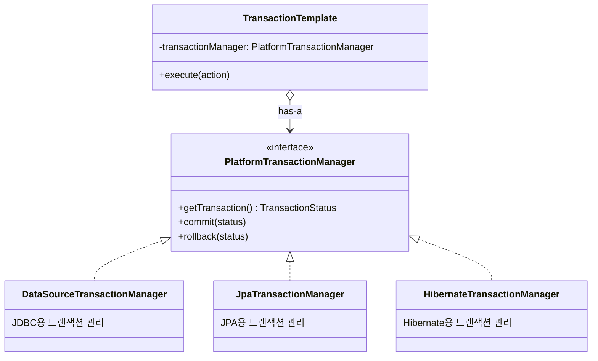
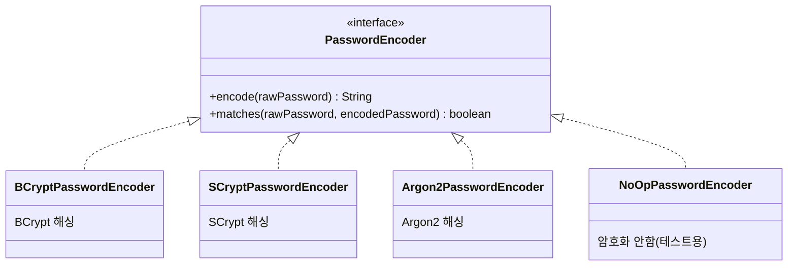
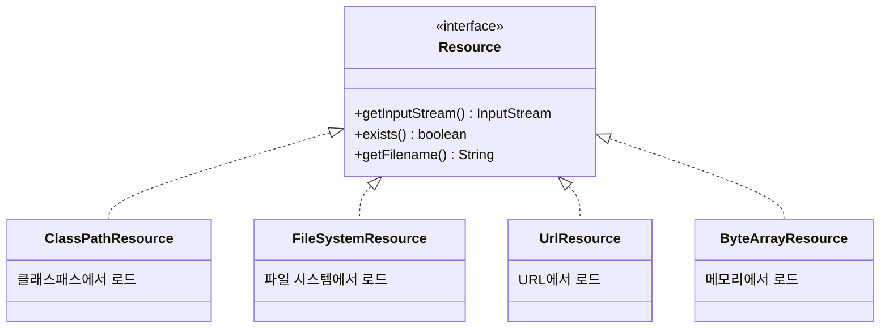
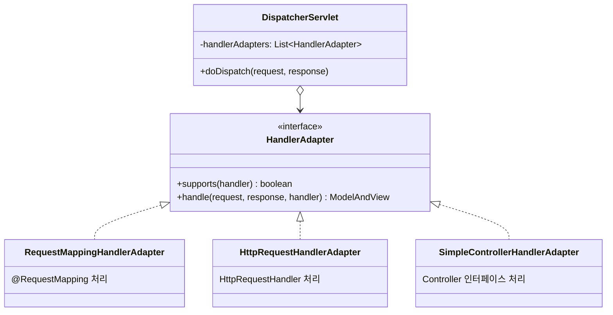
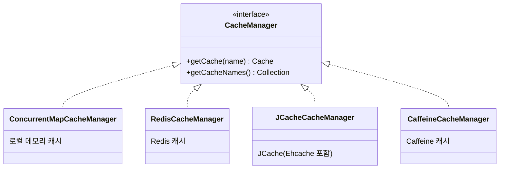

# 스프링 프레임워크의 전략 패턴 적용 사례

스프링 프레임워크는 전략 패턴을 매우 폭넓게 활용합니다. 프레임워크 전반이 **"인터페이스에 의존하라"** 는 원칙 위에 설계되어 있으며, 전략 패턴도 그 핵심 도구 중 하나입니다.

덕분에 스프링을 사용하는 개발자들은 구현 기술(JDBC/JPA, BCrypt/Argon2, Redis/Ehcache 등)을 자유롭게 교체할 수 있습니다.

---

## 1. PlatformTransactionManager (트랜잭션 관리)

가장 대표적인 전략 패턴 적용 사례입니다.

스프링에서 `@Transactional`을 붙이면 트랜잭션이 동작합니다. 그런데 트랜잭션을 관리하는 방식은 기술마다 전부 다릅니다. JDBC를 쓰느냐, JPA를 쓰느냐, Hibernate를 쓰느냐에 따라 트랜잭션
시작, 커밋, 롤백하는 코드가 완전히 다르거든요.

스프링은 이 문제를 전략 패턴으로 해결했습니다.



`PlatformTransactionManager`가 Strategy 인터페이스이고, 각 구현체(`DataSourceTransactionManager`, `JpaTransactionManager` 등)가
ConcreteStrategy입니다.

스프링의 트랜잭션 처리 코드(`TransactionTemplate`, `@Transactional` AOP)는 이 인터페이스에만 의존합니다. 그래서 우리가 JDBC에서 JPA로 기술을 바꿔도
`@Transactional`을 사용하는 비즈니스 코드는 전혀 수정할 필요가 없습니다.

```java
// 설정만 바꾸면 전략이 교체됨
@Bean
public PlatformTransactionManager transactionManager(DataSource dataSource) {
    return new DataSourceTransactionManager(dataSource);  // JDBC용
    // return new JpaTransactionManager(emf);             // JPA용으로 교체
}
```

---

## 2. PasswordEncoder (비밀번호 암호화)

Spring Security에서 비밀번호 암호화 방식도 전략 패턴입니다.

비밀번호를 해싱하는 알고리즘은 여러 가지가 있습니다. BCrypt, SCrypt, Argon2, PBKDF2 등등. 각각 장단점이 있고, 보안 요구사항에 따라 선택이 달라집니다.

Spring Security는 이를 `PasswordEncoder` 인터페이스로 추상화했습니다.



`AuthenticationManager`나 `UserDetailsService`를 사용하는 코드는 `PasswordEncoder` 인터페이스만 알면 됩니다. 어떤 알고리즘을 쓰든 `encode()`와
`matches()`만 호출하면 되니까요.

나중에 더 강력한 알고리즘으로 교체하고 싶다면, 빈 설정만 바꾸면 됩니다. 비밀번호를 검증하는 서비스 코드는 전혀 수정할 필요가 없습니다.

```java
@Bean
public PasswordEncoder passwordEncoder() {
    return new BCryptPasswordEncoder();     // 현재 전략
    // return new Argon2PasswordEncoder();  // 더 강력한 전략으로 교체 가능
}
```

---

## 3. Resource / ResourceLoader (리소스 로딩)

파일을 읽어올 때, 그 파일이 어디에 있느냐에 따라 읽는 방식이 다릅니다.

클래스패스에 있으면 `ClassLoader`를 통해 읽어야 하고, 파일 시스템에 있으면 `FileInputStream`으로, URL이면 `URLConnection`으로 읽어야 합니다. 스프링은 이것도 전략 패턴으로
추상화했습니다.



그래서 리소스를 사용하는 코드는 리소스가 어디서 오든 신경 쓰지 않아도 됩니다. `Resource` 인터페이스의 `getInputStream()`만 호출하면 되니까요.

클래스패스에서 읽든, 파일 시스템에서 읽든, 원격 URL에서 읽든 동일한 코드로 처리할 수 있습니다.

```java
// 어떤 Resource든 동일하게 사용
public void processResource(Resource resource) {
    try (InputStream is = resource.getInputStream()) {
        // 파일 처리 로직
    }
}

processResource(new ClassPathResource("config.xml"));           // 클래스패스

processResource(new FileSystemResource("/etc/app/config.xml")); // 파일시스템

processResource(new UrlResource("https://example.com/config")); // URL
```

---

## 4. HandlerAdapter (Spring MVC)

Spring MVC에서 컨트롤러를 실행하는 방식도 전략 패턴입니다.

스프링 MVC에서 컨트롤러를 만드는 방법은 여러 가지입니다. `@Controller`와 `@RequestMapping`을 쓰는 방법, `Controller` 인터페이스를 구현하는 방법,
`HttpRequestHandler`를 쓰는 방법 등이 있죠.

`DispatcherServlet`은 이 모든 방식을 다 지원해야 합니다. 하지만 각 방식마다 컨트롤러를 실행하는 코드가 다릅니다. 이 문제를 `HandlerAdapter` 전략으로 해결했습니다.



`DispatcherServlet`은 핸들러(컨트롤러)를 직접 실행하지 않습니다. 등록된 `HandlerAdapter`들 중에서 해당 핸들러를 지원하는 어댑터를 찾아서, 그 어댑터에게 실행을 위임합니다.

이를 통해 새로운 형태의 컨트롤러가 추가되어도 `DispatcherServlet` 코드는 수정할 필요가 없습니다. 새로운 `HandlerAdapter` 구현체만 추가하면 됩니다.

---

## 5. CacheManager (캐시 관리)

`@Cacheable`로 캐시를 사용할 때, 실제로 어떤 캐시 저장소를 쓸지도 전략입니다.

개발 환경에서는 간단한 로컬 메모리 캐시를 쓰다가, 운영 환경에서는 Redis나 Ehcache 같은 분산 캐시로 바꿀 수 있어야 합니다. 스프링은 `CacheManager` 인터페이스로 이를 추상화했습니다.



`@Cacheable`을 사용하는 서비스 코드는 캐시가 어디에 저장되는지 전혀 알 필요가 없습니다. 로컬 메모리에 저장되든, Redis에 저장되든, 서비스 코드는 동일합니다.

개발 환경에서 `ConcurrentMapCacheManager`를 쓰다가, 운영 환경에서 `RedisCacheManager`로 바꿔도 비즈니스 로직은 한 줄도 수정하지 않아도 됩니다.

```java
@Cacheable("users")  // 이 코드는 캐시 구현체가 뭐든 상관없음
public User findById(Long id) {
    return userRepository.findById(id).orElseThrow();
}
```

```java
// 환경에 따라 전략만 교체
@Bean
public CacheManager cacheManager() {
    // return new ConcurrentMapCacheManager();  // 개발용
    return RedisCacheManager.create(connectionFactory);  // 운영용
}
```

---

## 정리: 스프링이 전략 패턴을 사용하는 이유

| 영역      | Strategy 인터페이스             | ConcreteStrategy 예시                     |
|---------|----------------------------|-----------------------------------------|
| 트랜잭션    | PlatformTransactionManager | DataSourceTxManager, JpaTxManager       |
| 비밀번호    | PasswordEncoder            | BCryptEncoder, Argon2Encoder            |
| 리소스     | Resource                   | ClassPathResource, FileSystemResource   |
| MVC 핸들러 | HandlerAdapter             | RequestMappingHandlerAdapter            |
| 캐시      | CacheManager               | RedisCacheManager, CaffeineCacheManager |

스프링 프레임워크 전체가 **"구현이 아닌 인터페이스에 의존하라"** 는 원칙 위에 설계되어 있습니다. 이것이 전략 패턴의 핵심이고, 덕분에 개발자들은 구현 기술을 자유롭게 교체할 수 있습니다.

우리가 비즈니스 로직에서 전략 패턴을 적용하면, 스프링이 트랜잭션이나 캐시를 다루는 것처럼 유연하고 확장 가능한 구조를 만들 수 있습니다.
