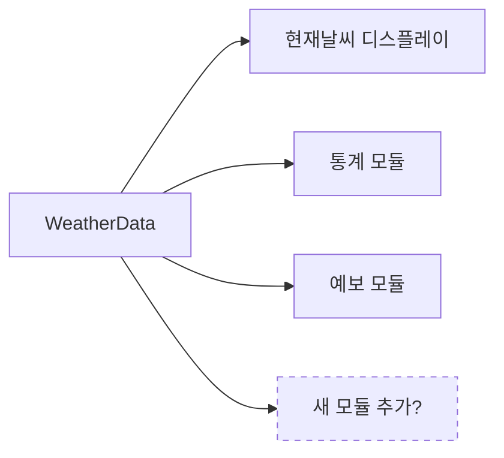
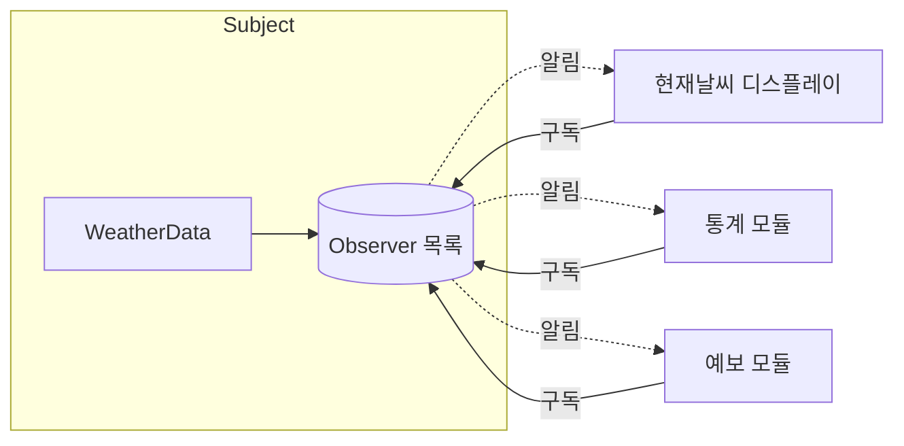
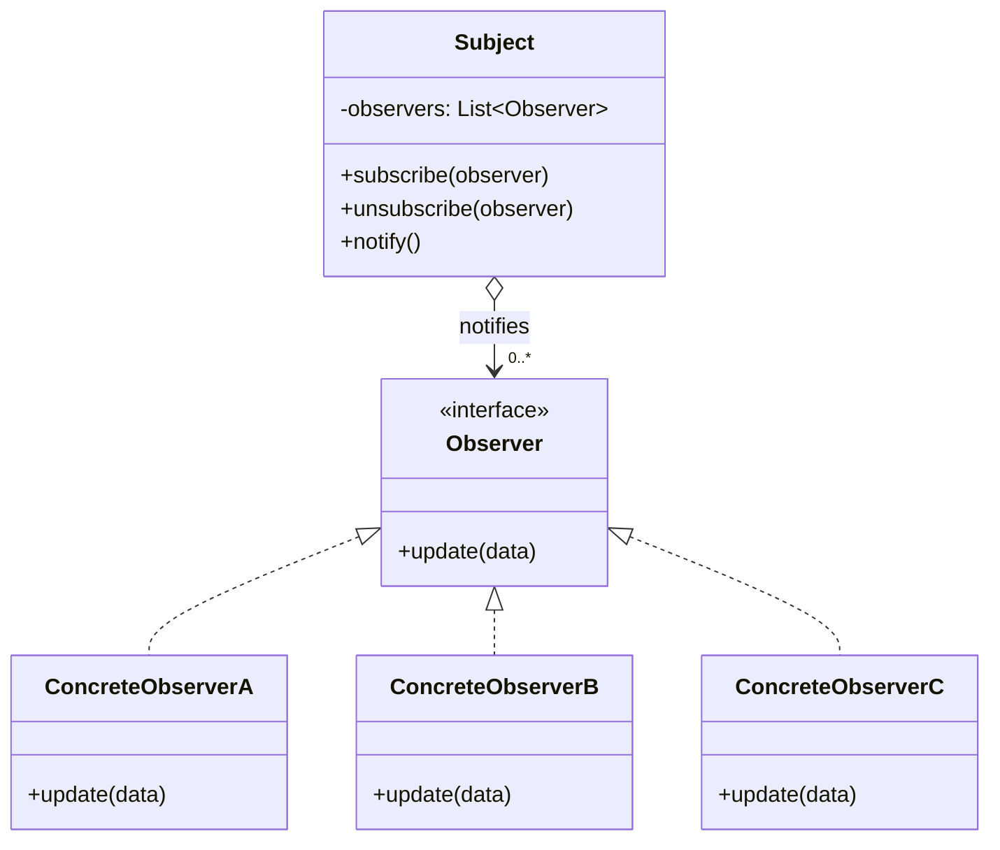
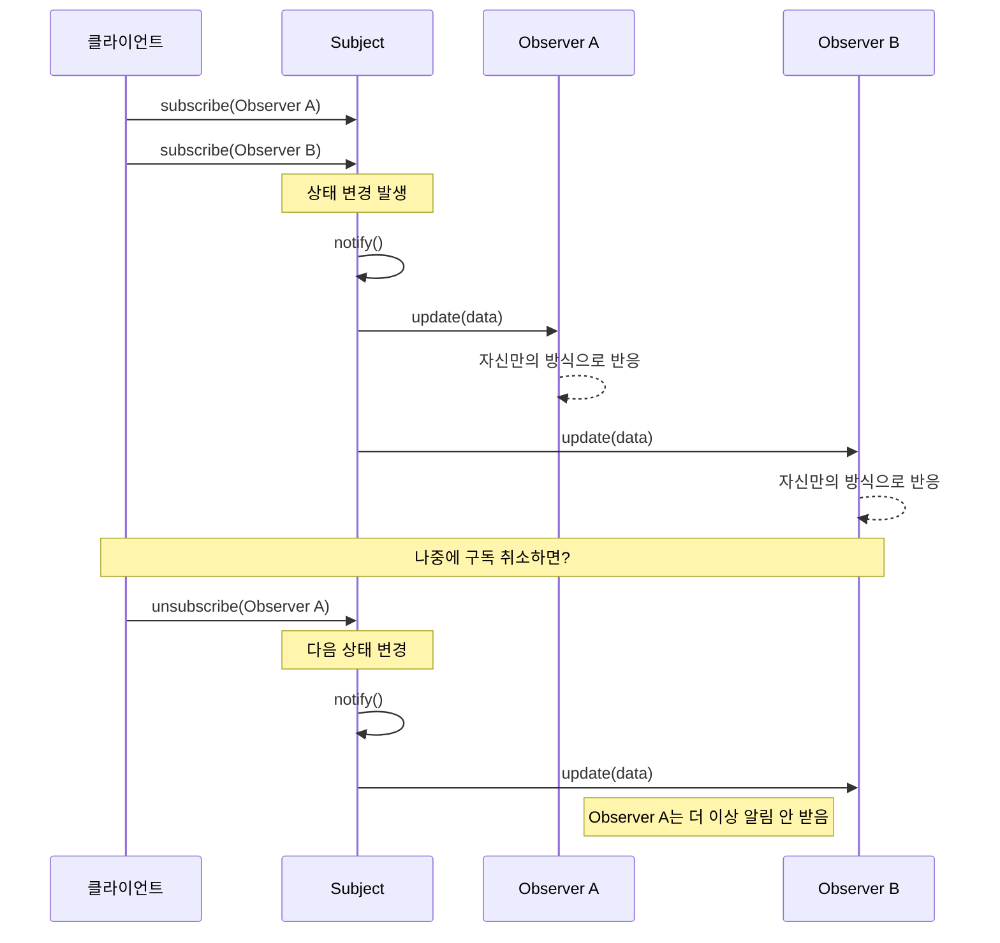
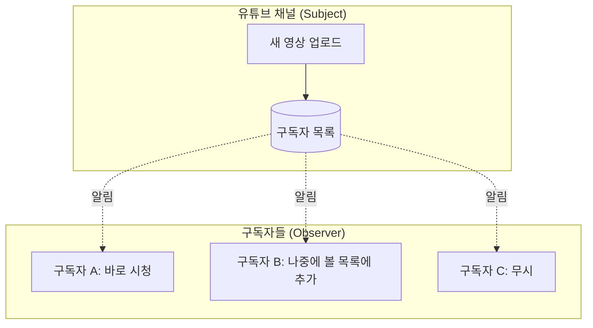
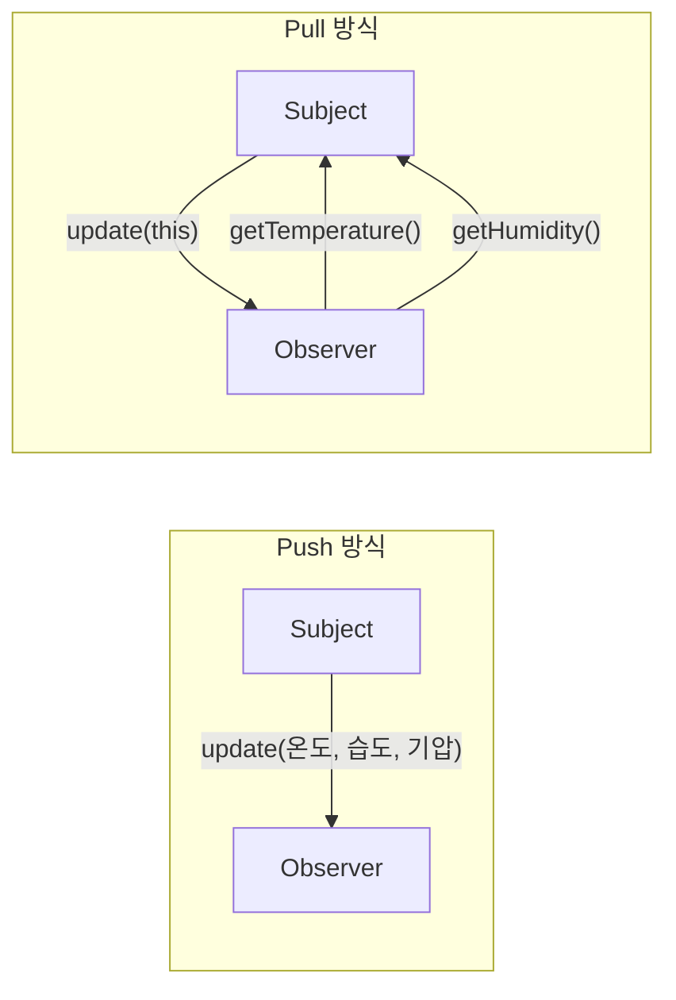
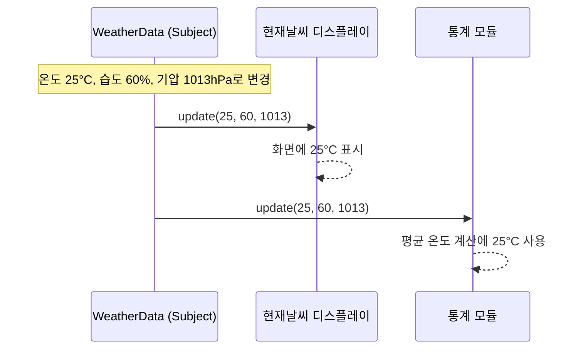
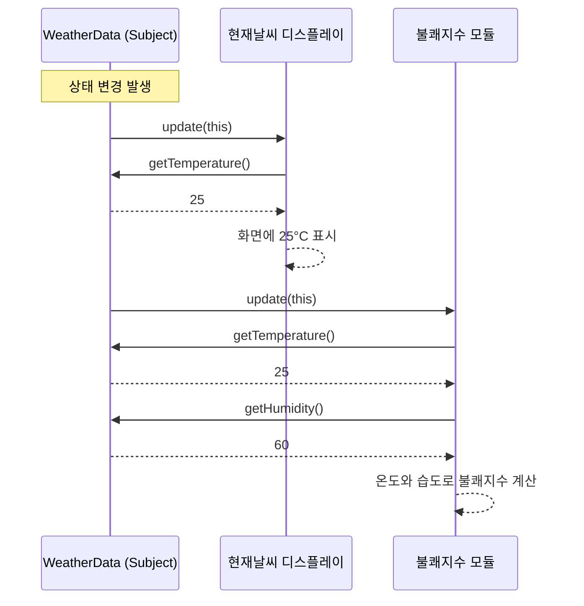
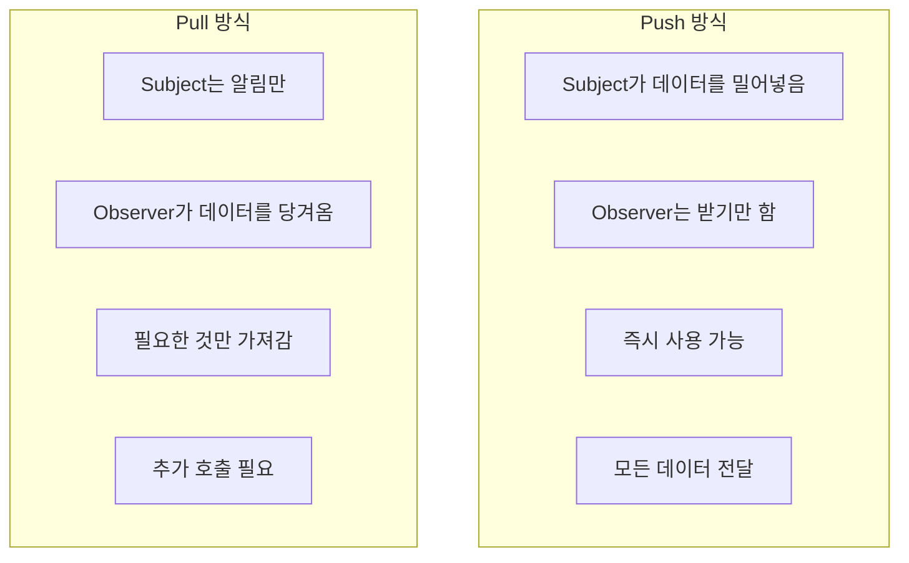
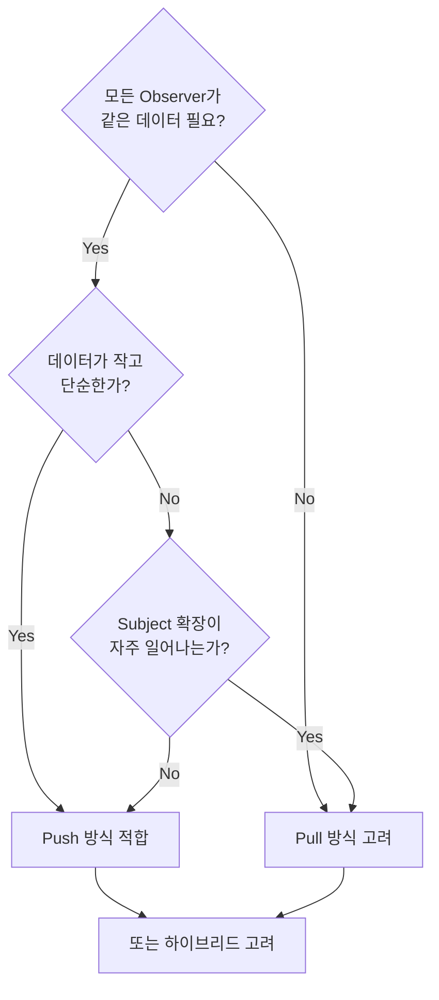

# 옵저버 패턴 (Observer Pattern)

GoF 디자인 패턴 중 **행위(Behavioral) 패턴**에 속합니다. 발행-구독(Publish-Subscribe)과 유사하게 설명되기도 하지만, 엄밀히는 구분되는 개념입니다.

---

## 정의

> 객체 사이에 일대다(1:N) 의존 관계를 정의하여, 한 객체의 상태가 변하면 그 객체에 의존하는 모든 객체에게 자동으로 알림이 가고 갱신되게 한다.

핵심 아이디어는 간단합니다. 어떤 객체(Subject)의 상태가 바뀌었을 때, 그 변화에 관심 있는 객체들(Observer)이 일일이 확인하러 오는 게 아니라, Subject가 "나 바뀌었어!"라고 알려주는 겁니다.

마치 유튜브 채널을 구독하면 새 영상이 올라올 때 알림이 오는 것처럼요.

---

## 왜 필요한가

날씨 정보를 제공하는 시스템을 생각해봅시다.

기상청에서 온도, 습도, 기압 데이터가 갱신되면, 이 정보를 필요로 하는 여러 곳이 있습니다. 현재 날씨를 보여주는 디스플레이, 기상 통계를 계산하는 모듈, 날씨 예보를 생성하는 모듈 등이 있죠.

가장 단순하게 생각하면, 날씨 데이터가 바뀔 때마다 `WeatherData` 클래스가 직접 각 모듈의 메서드를 호출할 수 있습니다.



하지만 이렇게 하면 `WeatherData`가 모든 모듈을 직접 알아야 합니다. 새로운 모듈이 추가될 때마다 `WeatherData` 코드를 수정해야 하고, 더 이상 필요 없는 모듈을 제거할 때도 마찬가지입니다.

변화에 취약하고, 결합도가 높습니다.

---

## 옵저버 패턴의 해결책

옵저버 패턴은 이 문제를 **"구독"** 개념으로 해결합니다.

`WeatherData`는 "나한테 관심 있는 사람은 등록해"라고 말하고, 각 모듈은 자발적으로 구독합니다. `WeatherData`는 구체적으로 누가 구독했는지, 그들이 뭘 하는지 알 필요가 없습니다.

그냥 "구독자 목록"을 가지고 있다가, 상태가 바뀌면 목록에 있는 모든 구독자에게 "바뀌었어!"라고 알려주기만 하면 됩니다.



여기서 중요한 건, Subject와 Observer 사이의 관계가 **느슨하게 연결(loose coupling)** 된다는 점입니다.

Subject는 Observer들이 공통으로 구현한 인터페이스만 알면 됩니다. 구체적으로 어떤 클래스인지, 내부에서 뭘 하는지는 전혀 몰라도 됩니다.

---

## 패턴의 구조



| 구성 요소                | 역할                                                     |
|----------------------|--------------------------------------------------------|
| **Subject**          | 상태를 가진 객체. Observer 목록을 관리하며, 상태가 변하면 모든 Observer에게 알림 |
| **Observer**         | Subject의 상태 변화에 관심을 가진 객체들의 공통 인터페이스                   |
| **ConcreteObserver** | Observer 인터페이스를 구현. 알림을 받으면 각자의 방식으로 반응                |

이 둘의 관계는 **일대다(1:N)** 입니다. 하나의 Subject에 여러 Observer가 등록될 수 있고, Subject의 상태가 한 번 변하면 모든 Observer에게 알림이 갑니다.

---

## 동작 흐름



Observer가 추가되거나 제거되어도 Subject의 알림 로직은 전혀 변경되지 않습니다. 그냥 목록을 순회하며 `update()`를 호출할 뿐이니까요.

---

## 실생활 비유

### 유튜브 구독

가장 직관적인 비유입니다.



유튜브 채널(Subject)이 있고, 구독자들(Observer)이 있습니다.

구독자는 채널에 "구독" 버튼을 눌러 등록합니다. 채널에 새 영상이 올라오면(상태 변화), 유튜브가 모든 구독자에게 알림을 보냅니다. 구독자는 알림을 받고 각자의 방식으로 반응합니다.

채널 주인은 구독자가 누구인지, 몇 명인지, 알림 받고 뭘 하는지 알 필요가 없습니다.

### 신문 구독

신문사(Subject)는 매일 신문을 발행하고, 구독자(Observer)들에게 배달합니다.

새로운 구독자가 생기면 배달 목록에 추가하고, 구독을 취소하면 목록에서 제거합니다. 신문사는 구독자가 신문을 읽든, 포장지로 쓰든 상관하지 않습니다.

---

## Push vs Pull

옵저버 패턴에서 데이터를 전달하는 방식은 두 가지가 있습니다.



| 방식       | 설명                                     | 장점                     | 단점                      |
|----------|----------------------------------------|------------------------|-------------------------|
| **Push** | Subject가 알림 시 데이터를 함께 전달               | Observer가 바로 데이터 사용 가능 | 필요 없는 데이터도 받을 수 있음      |
| **Pull** | Subject는 알림만, Observer가 필요한 데이터를 직접 요청 | 필요한 것만 가져감             | Subject 참조 필요, 추가 호출 발생 |

어떤 방식이 좋은지는 상황에 따라 다릅니다. Observer마다 필요한 데이터가 다르다면 Pull 방식이 나을 수 있고, 모든 Observer가 같은 데이터를 필요로 한다면 Push 방식이 효율적입니다.

---

## 옵저버 패턴의 본질

옵저버 패턴의 본질은 **"의존성 역전"** 과 **"변화의 전파"** 입니다.

### 의존성 역전

원래라면 상태를 가진 객체가 상태를 필요로 하는 모든 객체를 알아야 합니다.

하지만 옵저버 패턴을 쓰면 그 관계가 역전됩니다. 상태가 필요한 객체들이 스스로 와서 등록하는 거죠. Subject는 Observer 인터페이스만 알면 되고, 구체적인 구현체는 몰라도 됩니다.

### 변화의 전파

한 번의 상태 변화가 여러 곳으로 자동 전파됩니다.

Subject가 명시적으로 각 객체를 호출하는 게 아니라, 등록된 Observer 목록을 순회하며 알림을 보내기만 하면 됩니다. 새로운 Observer가 추가되거나 기존 Observer가 제거되어도 Subject
코드는 변경되지 않습니다.

---

## 핵심 정리

> **옵저버 패턴 = 상태 변화를 관심 있는 모든 객체에게 자동으로 알림**

옵저버 패턴은 **"누가 내 상태에 관심 있는지 몰라도, 관심 있는 모든 이에게 변화를 알릴 수 있게"** 해주는 패턴입니다.

Subject는 Observer 인터페이스에만 의존하므로, 구체적인 Observer가 추가되거나 제거되어도 Subject 코드는 전혀 수정할 필요가 없습니다. 이것이 느슨한 결합(loose coupling)의
힘입니다.

---

# 옵저버 패턴: Push vs Pull 방식

옵저버 패턴에서 Subject가 Observer에게 데이터를 전달하는 방식은 크게 **Push**와 **Pull** 두 가지가 있습니다.

어떤 방식을 선택하느냐에 따라 시스템의 결합도, 유연성, 성능이 달라지므로, 각 방식의 특성을 이해하고 상황에 맞게 선택해야 합니다.

---

## Push 방식

### 동작 원리

Subject가 상태 변화를 알릴 때, **변경된 데이터를 함께 밀어넣어(push) 전달**하는 방식입니다.

Observer는 전달받은 데이터를 그대로 사용하면 됩니다.



Subject가 "온도는 25도, 습도는 60%, 기압은 1013이야!"라고 모든 정보를 한꺼번에 전달합니다.

Observer는 받은 데이터 중 필요한 것만 골라서 사용하면 됩니다.

### 장점

**즉시 사용 가능**: Observer가 알림을 받는 순간 필요한 데이터가 이미 손에 있습니다. 추가로 Subject에게 물어볼 필요가 없어서 응답 시간이 빠릅니다.

**Subject 참조 불필요**: Observer는 Subject에 대한 참조를 유지할 필요가 없습니다. `update()` 메서드로 데이터가 들어오니까요. 이는 Observer와 Subject 간의 결합도를 더
낮춰줍니다.

**단순한 Observer 구현**: Observer 입장에서는 그냥 받은 데이터를 처리하기만 하면 됩니다. Subject의 내부 구조나 getter 메서드를 알 필요가 없습니다.

### 단점

**불필요한 데이터 전달**: 모든 Observer에게 모든 데이터를 보냅니다. 현재날씨 디스플레이는 온도만 필요한데, 습도와 기압까지 받아야 합니다. 데이터가 많아지면 오버헤드가 됩니다.

**인터페이스 변경의 어려움**: Subject의 상태에 새로운 필드(예: 풍속)가 추가되면, `update(temp, humidity, pressure, windSpeed)` 처럼 인터페이스 시그니처가 바뀝니다.
모든 Observer의 `update()` 메서드를 수정해야 할 수 있습니다.

**Observer별 맞춤 불가**: 모든 Observer가 동일한 형태의 데이터를 받습니다. 어떤 Observer는 원본 데이터가 필요하고, 어떤 Observer는 가공된 데이터가 필요해도 구분할 수 없습니다.

---

## Pull 방식

### 동작 원리

Subject는 "나 바뀌었어!"라는 **알림만 보내고**, Observer가 필요한 데이터를 **직접 당겨와서(pull) 가져가는** 방식입니다.



Subject가 "나 바뀌었어!"라고만 알리고, 자기 자신(`this`)을 넘겨줍니다.

Observer는 Subject의 getter를 호출해서 필요한 데이터만 가져갑니다.

### 장점

**필요한 것만 가져감**: Observer마다 필요한 데이터가 다를 때 효율적입니다. 현재날씨 디스플레이는 온도만, 불쾌지수 모듈은 온도와 습도만 가져가면 됩니다.

**인터페이스 안정성**: Subject에 새로운 상태(풍속)가 추가되어도 `update()` 시그니처는 바뀌지 않습니다. 기존 Observer들은 수정 없이 그대로 동작하고, 풍속이 필요한 Observer만
`getWindSpeed()`를 호출하면 됩니다.

**유연한 데이터 요청**: Observer가 원할 때 원하는 데이터를 요청할 수 있습니다. 단순 getter뿐 아니라 `getAverageTemperature(lastHours)` 같은 계산된 데이터도 요청할 수
있습니다.

### 단점

**Subject 참조 필요**: Observer가 데이터를 가져오려면 Subject에 대한 참조를 알아야 합니다. 이는 결합도를 높이는 요인이 됩니다.

**추가 호출 오버헤드**: 알림을 받고 나서 다시 Subject에게 데이터를 요청하는 추가 호출이 발생합니다. Observer가 많고, 각각 여러 데이터를 요청하면 호출 횟수가 늘어납니다.

**Subject API 노출**: Observer가 Subject의 getter 메서드들을 알아야 합니다. Subject의 내부 구조가 어느 정도 노출되는 셈입니다.

**타이밍 이슈**: Observer가 데이터를 요청하는 시점에 Subject의 상태가 또 바뀌어 있을 수 있습니다. 알림 받았을 때의 상태와 데이터를 가져올 때의 상태가 다를 수 있습니다.

---

## 비교 정리



| 관점         | Push                      | Pull                      |
|------------|---------------------------|---------------------------|
| 데이터 전달     | Subject → Observer (한 번에) | Observer → Subject (요청 시) |
| Subject 참조 | Observer가 몰라도 됨           | Observer가 알아야 함           |
| 호출 횟수      | 1회 (알림과 함께)               | 1 + N회 (알림 + 데이터 요청)      |
| 유연성        | 낮음 (고정된 데이터)              | 높음 (필요한 것만)               |
| 확장성        | 인터페이스 변경 필요               | 새 getter 추가만              |
| 결합도        | 낮음                        | 상대적으로 높음                  |

---

## 언제 어떤 방식을 사용하는가

### Push가 적합한 경우

**모든 Observer가 동일한 데이터를 필요로 할 때**가 가장 적합합니다.

예를 들어 채팅 시스템에서 새 메시지가 오면, 모든 클라이언트가 동일한 메시지 내용을 받아야 합니다. 굳이 각 클라이언트가 서버에 메시지를 다시 요청할 이유가 없습니다.

**실시간성이 중요할 때**도 Push가 유리합니다.

주식 가격 알림처럼 즉각적인 반응이 필요한 경우, 알림과 함께 데이터가 오면 바로 처리할 수 있습니다.

**Observer가 Subject를 몰라야 할 때**, 즉 결합도를 최소화해야 할 때도 Push가 좋습니다.

Observer는 그냥 데이터가 오면 처리하는 역할만 하면 됩니다.

### Pull이 적합한 경우

**Observer마다 필요한 데이터가 다를 때**입니다.

날씨 시스템에서 어떤 디스플레이는 온도만, 어떤 모듈은 온도+습도+기압 전부가 필요하다면, Push로 모든 데이터를 보내는 건 비효율적입니다.

**Subject의 상태가 복잡하거나 자주 확장될 때**도 Pull이 좋습니다.

새로운 상태가 추가되어도 Observer 인터페이스를 바꿀 필요 없이, 필요한 Observer만 새 getter를 호출하면 됩니다.

**데이터가 크거나 계산 비용이 높을 때**도 Pull이 유리합니다.

모든 Observer에게 무조건 큰 데이터를 보내는 것보다, 필요한 Observer만 요청해서 가져가는 게 효율적입니다.

---

## 선택 기준 플로우



---

## 실제 사용례

### Push 방식 사용례

**Java Swing 이벤트 모델**: 버튼 클릭 같은 이벤트가 발생하면, `ActionEvent` 객체에 이벤트 정보를 담아서 리스너에게 전달합니다. 리스너는 전달받은 이벤트 객체에서 필요한 정보를 꺼내 씁니다.

**Spring ApplicationEvent**: 스프링 이벤트 시스템은 기본적으로 Push 방식입니다. 이벤트 발행 시 이벤트 객체에 데이터를 담아서 보내고, 리스너는 그 이벤트 객체를 받아서 처리합니다.

```java
// 이벤트에 데이터를 담아서 발행 (Push)
public class OrderCreatedEvent {
    private final Long orderId;
    private final BigDecimal amount;
}

eventPublisher.publishEvent(new OrderCreatedEvent(orderId, amount));
```

**WebSocket 메시지 전송**: 서버에서 클라이언트로 메시지를 보낼 때, 메시지 내용을 함께 Push합니다. 클라이언트가 다시 서버에 "방금 보낸 메시지 뭐야?"라고 물어보는 건 비효율적이니까요.

**Kafka, RabbitMQ 같은 메시지 큐**: Producer가 메시지를 발행하면, 메시지 내용과 함께 Consumer에게 전달됩니다.

### Pull 방식 사용례

**Java Observable (deprecated)**: Java 9 이전의 `Observable` 클래스는 Pull 방식이었습니다. `update(Observable o, Object arg)` 메서드에서
Observable 참조를 받아서, 필요한 데이터를 getter로 가져왔습니다.

**JavaScript MutationObserver**: DOM 변경을 감지하는 옵저버인데, 알림을 받으면 `MutationRecord` 목록을 통해 어떤 변경이 있었는지 Pull 방식으로 조회합니다.

**데이터베이스 변경 감지**: 일부 시스템에서는 "테이블이 변경되었다"는 알림만 받고, 실제로 어떤 레코드가 어떻게 바뀌었는지는 쿼리로 직접 조회합니다. 변경된 데이터가 클 수 있기 때문입니다.

### 하이브리드 방식

실제로는 Push와 Pull을 **혼합**해서 쓰는 경우도 많습니다.

**이벤트 소싱/CQRS 패턴**: 이벤트 발생 시 이벤트 ID나 타입 같은 최소한의 정보만 Push하고, 상세 데이터가 필요한 Observer만 이벤트 저장소에서 Pull해서 가져갑니다.

**Spring Data 도메인 이벤트**: 도메인 이벤트에 엔티티 ID만 담아서 Push하고, 리스너가 필요하면 해당 ID로 Repository에서 조회(Pull)합니다.

```java
// 하이브리드: ID만 Push
public class OrderCreatedEvent {
    private final Long orderId;  // ID만 담음
}

@EventListener
public void handleOrderCreated(OrderCreatedEvent event) {
    // 필요하면 Pull
    Order order = orderRepository.findById(event.getOrderId());
}
```

이렇게 하면 이벤트 객체가 가벼워지고, 이벤트 발행 시점과 처리 시점의 데이터 정합성 문제도 줄어듭니다.

---

## 핵심 정리

| 상황                       | 권장 방식 |
|--------------------------|-------|
| 모든 Observer가 같은 데이터 필요   | Push  |
| 실시간성이 중요                 | Push  |
| Observer가 Subject를 몰라야 함 | Push  |
| Observer마다 필요한 데이터가 다름   | Pull  |
| Subject 상태가 자주 확장됨       | Pull  |
| 데이터가 크거나 계산 비용이 높음       | Pull  |
| 이벤트는 가볍게, 데이터는 필요할 때     | 하이브리드 |

정답은 없습니다. 시스템의 요구사항, 데이터의 크기와 복잡도, 확장 가능성 등을 고려해서 선택해야 합니다.

확실하지 않다면 Push로 시작해서, 문제가 생기면 Pull이나 하이브리드로 리팩토링하는 것도 좋은 접근법입니다.
