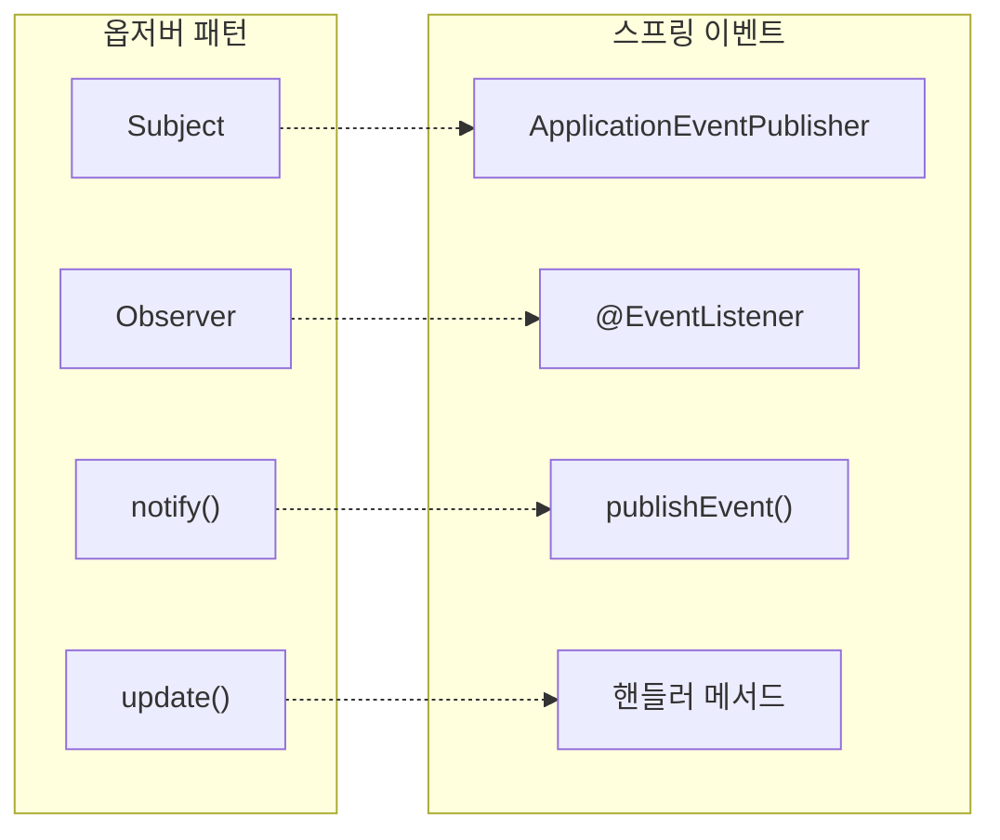
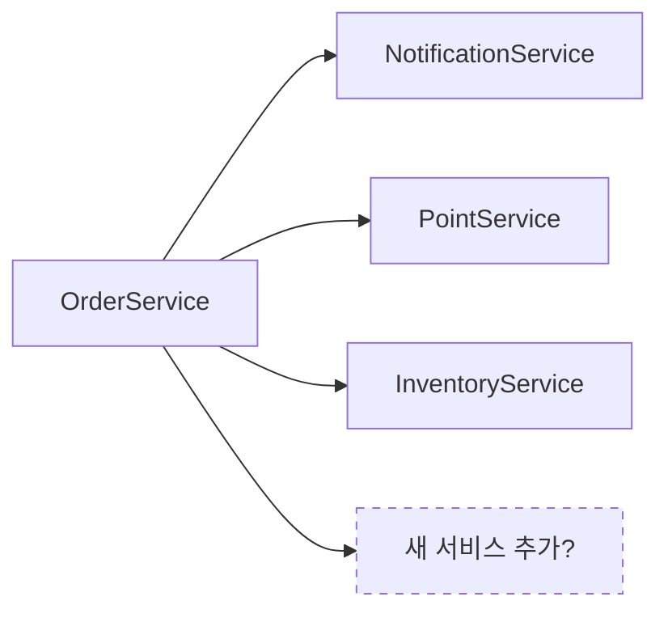
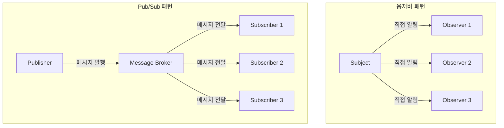
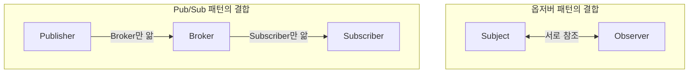
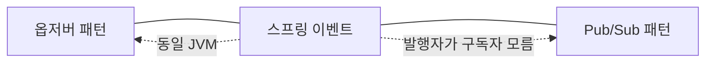

# 스프링 이벤트 시스템과 옵저버 패턴

스프링의 `ApplicationEventPublisher`와 `@EventListener`는 옵저버 패턴의 프레임워크 레벨 구현입니다.

우리가 직접 Subject, Observer 인터페이스를 만들 필요 없이, 스프링이 제공하는 기능을 사용하면 됩니다.

---

## 옵저버 패턴과의 매핑



| 옵저버 패턴     | 스프링 이벤트                     |
|------------|-----------------------------|
| Subject    | `ApplicationEventPublisher` |
| Observer   | `@EventListener` 붙은 메서드     |
| `notify()` | `publishEvent()`            |
| `update()` | 이벤트 핸들러 메서드                 |
| 이벤트 데이터    | Event 객체                    |

---

## AS-IS: 직접 호출 방식

주문이 생성되면 알림 발송, 포인트 적립, 재고 차감 등 여러 후속 작업이 필요한 상황입니다.

```java
/**
 * AS-IS: 모든 후속 서비스를 직접 호출
 *
 * 문제점:
 * - OrderService가 모든 후속 서비스를 알아야 함
 * - 새로운 후속 작업 추가 시 OrderService 수정 필요
 * - 후속 작업 하나가 실패하면 주문 생성도 롤백됨
 */
@Service
@RequiredArgsConstructor
public class OrderService {

    private final OrderRepository orderRepository;
    private final NotificationService notificationService;
    private final PointService pointService;
    private final InventoryService inventoryService;
    // 새로운 서비스 추가될 때마다 필드 추가...

    @Transactional
    public Order createOrder(OrderRequest request) {
        // 1. 주문 생성
        Order order = Order.create(request);
        orderRepository.save(order);

        // 2. 후속 작업들을 직접 호출 (강한 결합!)
        notificationService.sendOrderConfirmation(order);
        pointService.addPoints(order.getMemberId(), order.calculatePoints());
        inventoryService.decreaseStock(order.getOrderItems());
        // 새로운 후속 작업이 추가되면 여기도 수정...

        return order;
    }
}
```



OrderService가 모든 후속 서비스를 직접 알고 있습니다. 결합도가 매우 높고, 새로운 요구사항이 생길 때마다 OrderService를 수정해야 합니다.

---

## TO-BE: 스프링 이벤트 적용

### 이벤트 클래스

```java
/**
 * 주문 생성 이벤트
 * 불변(immutable)으로 만드는 것이 좋음
 */
public class OrderCreatedEvent {

    private final Long orderId;
    private final Long memberId;
    private final BigDecimal totalAmount;
    private final List<OrderItemInfo> orderItems;
    private final LocalDateTime createdAt;

    public OrderCreatedEvent(Order order) {
        this.orderId = order.getId();
        this.memberId = order.getMemberId();
        this.totalAmount = order.getTotalAmount();
        this.orderItems = order.getOrderItems().stream()
                .map(OrderItemInfo::from)
                .toList();
        this.createdAt = LocalDateTime.now();
    }

    // Getter들
    public Long getOrderId() {
        return orderId;
    }

    public Long getMemberId() {
        return memberId;
    }

    public BigDecimal getTotalAmount() {
        return totalAmount;
    }

    public List<OrderItemInfo> getOrderItems() {
        return orderItems;
    }

    public LocalDateTime getCreatedAt() {
        return createdAt;
    }
}
```

### OrderService (이벤트 발행)

```java
/**
 * TO-BE: 이벤트만 발행하고, 후속 작업은 신경 쓰지 않음
 *
 * 개선점:
 * - 후속 서비스들을 전혀 모름
 * - 새로운 후속 작업 추가 시 이 클래스는 수정 불필요
 * - 주문 생성이라는 핵심 책임에만 집중
 */
@Service
@RequiredArgsConstructor
public class OrderService {

    private final OrderRepository orderRepository;
    private final ApplicationEventPublisher eventPublisher;

    @Transactional
    public Order createOrder(OrderRequest request) {
        // 1. 주문 생성 (핵심 비즈니스 로직)
        Order order = Order.create(request);
        orderRepository.save(order);

        // 2. 이벤트 발행 (후속 작업은 리스너들이 처리)
        eventPublisher.publishEvent(new OrderCreatedEvent(order));

        return order;
    }
}
```

### 이벤트 리스너들

```java
/**
 * 알림 리스너
 */
@Component
@RequiredArgsConstructor
public class NotificationEventListener {

    private final NotificationService notificationService;

    @EventListener
    public void handleOrderCreated(OrderCreatedEvent event) {
        notificationService.sendOrderConfirmation(
                event.getOrderId(),
                event.getMemberId()
        );
    }
}
```

```java
/**
 * 포인트 리스너
 */
@Component
@RequiredArgsConstructor
public class PointEventListener {

    private final PointService pointService;

    @EventListener
    public void handleOrderCreated(OrderCreatedEvent event) {
        int points = event.getTotalAmount().intValue() / 100;
        pointService.addPoints(event.getMemberId(), points);
    }
}
```

```java
/**
 * 재고 리스너
 */
@Component
@RequiredArgsConstructor
public class InventoryEventListener {

    private final InventoryService inventoryService;

    @EventListener
    public void handleOrderCreated(OrderCreatedEvent event) {
        inventoryService.decreaseStock(event.getOrderItems());
    }
}
```

### 새로운 요구사항 추가

분석 데이터 수집이 필요해졌습니다. **OrderService는 전혀 수정하지 않고** 리스너만 추가합니다.

```java
/**
 * 분석 리스너 - 새로 추가
 * OrderService 수정 없이 이 클래스만 추가하면 됨
 */
@Component
@RequiredArgsConstructor
public class AnalyticsEventListener {

    private final AnalyticsService analyticsService;

    @EventListener
    public void handleOrderCreated(OrderCreatedEvent event) {
        analyticsService.trackOrderCreated(
                event.getOrderId(),
                event.getTotalAmount(),
                event.getCreatedAt()
        );
    }
}
```

---

## 구조 비교

```mermaid
flowchart TB
    subgraph ASIS["AS-IS: 직접 호출"]
        OS1[OrderService]
        OS1 --> NS1[NotificationService]
        OS1 --> PS1[PointService]
        OS1 --> IS1[InventoryService]
    end

    subgraph TOBE["TO-BE: 이벤트 기반"]
        OS2[OrderService]
        OS2 -->|publishEvent| E[OrderCreatedEvent]
        E -.->|@EventListener| NL[NotificationListener]
        E -.->|@EventListener| PL[PointListener]
        E -.->|@EventListener| IL[InventoryListener]
        E -.->|@EventListener| AL[AnalyticsListener]
    end
```

---

## 스프링 이벤트의 추가 기능

### 비동기 처리 (@Async)

기본적으로 스프링 이벤트는 동기로 처리됩니다. 비동기로 처리하고 싶다면 `@Async`를 붙입니다.

```java

@Component
public class AnalyticsEventListener {

    /**
     * 비동기 처리
     * - 별도 스레드에서 실행
     * - 실패해도 주문 생성에 영향 없음
     */
    @Async
    @EventListener
    public void handleOrderCreated(OrderCreatedEvent event) {
        // 시간이 오래 걸리는 분석 작업...
    }
}
```

```java
// @Async 사용하려면 설정 필요
@Configuration
@EnableAsync
public class AsyncConfig {
}
```

### 트랜잭션 바운드 이벤트 (@TransactionalEventListener)

트랜잭션이 커밋된 후에만 리스너를 실행하고 싶다면 `@TransactionalEventListener`를 사용합니다.

```java

@Component
public class NotificationEventListener {

    /**
     * 트랜잭션 커밋 후에만 실행
     * - 주문이 실제로 저장된 후에 알림 발송
     * - 트랜잭션 롤백 시 실행되지 않음
     */
    @TransactionalEventListener(phase = TransactionPhase.AFTER_COMMIT)
    public void handleOrderCreated(OrderCreatedEvent event) {
        notificationService.sendOrderConfirmation(event.getOrderId());
    }
}
```

| TransactionPhase   | 실행 시점                |
|--------------------|----------------------|
| `AFTER_COMMIT`     | 트랜잭션 커밋 후 (기본값)      |
| `AFTER_ROLLBACK`   | 트랜잭션 롤백 후            |
| `AFTER_COMPLETION` | 트랜잭션 완료 후 (커밋/롤백 무관) |
| `BEFORE_COMMIT`    | 트랜잭션 커밋 직전           |

### 실행 순서 지정 (@Order)

```java

@EventListener
@Order(1)  // 먼저 실행
public void handleFirst(OrderCreatedEvent event) {
}

@EventListener
@Order(2)  // 나중에 실행
public void handleSecond(OrderCreatedEvent event) {
}
```

---

## 옵저버 패턴 vs Pub/Sub 패턴

스프링 이벤트를 "Pub/Sub"이라고 부르기도 하는데, 엄밀히 말하면 옵저버 패턴과 Pub/Sub 패턴은 다릅니다.

### 핵심 차이: 중간 매개체의 유무



**옵저버 패턴**에서 Subject는 Observer 목록을 직접 관리합니다. `subscribe()`, `unsubscribe()`, `notify()` 메서드가 Subject에 있고, Subject가
Observer들에게 직접 알림을 보냅니다.

**Pub/Sub 패턴**에서 Publisher와 Subscriber는 서로를 전혀 모릅니다. 중간에 **Message Broker(또는 Event Channel)** 가 있어서 메시지를 중계합니다.
Publisher는 브로커에게 메시지를 보내고, Subscriber는 브로커로부터 메시지를 받습니다.

### 결합도 비교



| 관점                        | 옵저버 패턴              | Pub/Sub 패턴             |
|---------------------------|---------------------|------------------------|
| Subject/Publisher가 아는 것   | Observer 목록 (인터페이스) | 메시지 브로커만               |
| Observer/Subscriber가 아는 것 | Subject (보통 참조 필요)  | 메시지 브로커만               |
| 결합도                       | 느슨하지만 존재함           | 완전히 분리됨                |
| 동일 프로세스                   | 보통 같은 프로세스          | 다른 프로세스/서버 가능          |
| 메시지 브로커                   | 없음                  | 있음 (Kafka, RabbitMQ 등) |

### 실제 Pub/Sub 예시

Kafka를 사용한 진정한 Pub/Sub입니다.

```java
/**
 * Publisher - Kafka에 메시지 발행
 * Subscriber가 누구인지, 몇 명인지 전혀 모름
 */
@Service
@RequiredArgsConstructor
public class OrderService {

    private final KafkaTemplate<String, OrderCreatedEvent> kafkaTemplate;

    public Order createOrder(OrderRequest request) {
        Order order = Order.create(request);
        orderRepository.save(order);

        // Kafka 토픽에 메시지 발행 (Subscriber를 전혀 모름)
        kafkaTemplate.send("order-created-topic", new OrderCreatedEvent(order));

        return order;
    }
}
```

```java
/**
 * Subscriber - Kafka에서 메시지 수신
 * Publisher가 누구인지 전혀 모름
 * 심지어 다른 서버에서 실행될 수도 있음
 */
@Component
public class NotificationSubscriber {

    @KafkaListener(topics = "order-created-topic")
    public void handleOrderCreated(OrderCreatedEvent event) {
        notificationService.sendOrderConfirmation(event.getOrderId());
    }
}
```

Publisher와 Subscriber가 **서로 다른 애플리케이션**에 있어도 됩니다. 서로를 전혀 모르고, Kafka라는 브로커만 알면 됩니다.

### 스프링 이벤트는 어디에 속하는가?



스프링의 `ApplicationEventPublisher`는 두 패턴의 **중간 지점**에 있습니다.

**옵저버 패턴처럼 동작하는 부분:**

- 동일한 JVM 내에서 동작
- 동기적으로 처리 가능
- 스프링 컨텍스트가 Observer 목록을 관리

**Pub/Sub처럼 동작하는 부분:**

- Publisher(OrderService)가 Subscriber(@EventListener)를 전혀 모름
- 스프링 컨텍스트가 중간 매개체 역할

엄밀히 말하면 **"같은 JVM 내에서 동작하는 경량 Pub/Sub"** 또는 **"스프링이 관리하는 옵저버 패턴"** 이라고 할 수 있습니다.

### 언제 무엇을 사용하는가

| 상황             | 권장 방식                     |
|----------------|---------------------------|
| 같은 모듈 내 느슨한 결합 | 스프링 이벤트                   |
| 마이크로서비스 간 통신   | Pub/Sub (Kafka, RabbitMQ) |
| 단순한 콜백 구조      | 옵저버 패턴 직접 구현              |
| 이벤트 영속성 필요     | Pub/Sub (메시지 브로커)         |
| 재처리/재시도 필요     | Pub/Sub (메시지 브로커)         |

---

## 최종 비교

| 관점      | AS-IS (직접 호출)  | TO-BE (스프링 이벤트)             |
|---------|----------------|-----------------------------|
| 결합도     | 높음             | 낮음                          |
| 새 기능 추가 | 발행자 수정 필요      | 리스너만 추가                     |
| 실패 처리   | 하나 실패 시 전체 롤백  | @Async로 분리 가능               |
| 트랜잭션 제어 | 어려움            | @TransactionalEventListener |
| 테스트     | 모든 의존성 Mock 필요 | 이벤트 발행만 검증                  |

| 관점      | 옵저버 패턴 | 스프링 이벤트  | Pub/Sub |
|---------|--------|----------|---------|
| 중간 매개체  | 없음     | 스프링 컨텍스트 | 메시지 브로커 |
| 분산 환경   | 불가     | 불가       | 가능      |
| 메시지 영속성 | 없음     | 없음       | 있음      |
| 결합도     | 낮음     | 매우 낮음    | 완전 분리   |