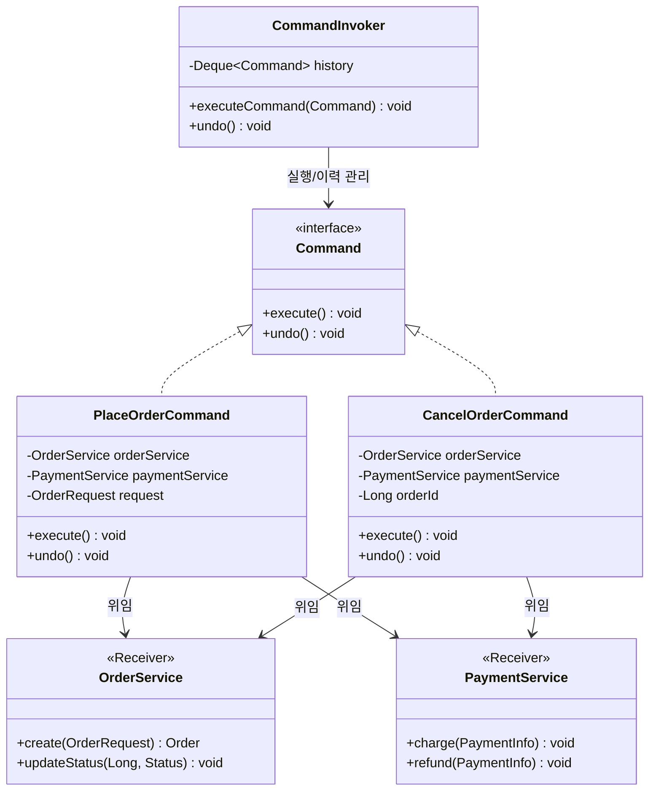
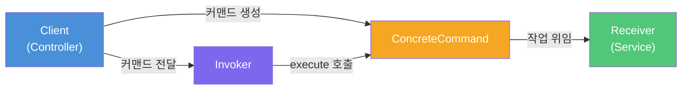
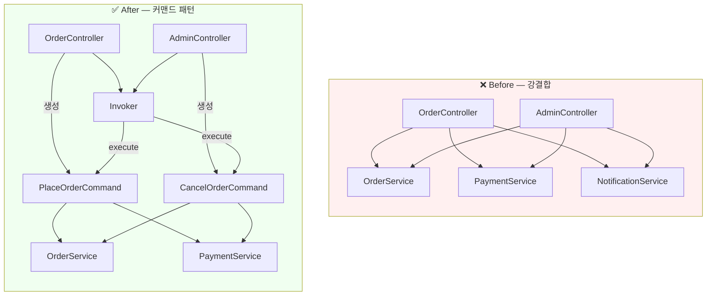
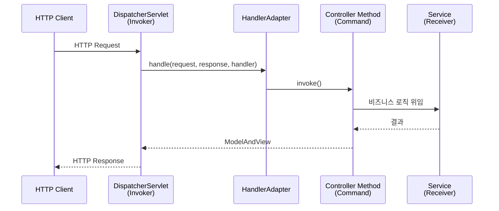

# 커맨드 패턴 (Command Pattern)

> **"동사를 명사로 바꿔라"** — 수행할 작업(요청)을 독립적인 객체로 캡슐화하여, 요청의 발신자와 수신자를 분리하는 행위(Behavioral) 디자인 패턴

---

## 1. 상황 제시 — 직접 호출의 고통

온라인 쇼핑몰의 주문 처리 시스템을 만들고 있다고 해보자.
주문 접수, 결제, 취소 등 다양한 작업이 있고, 이 작업들은 REST API, 관리자 페이지, 배치 스케줄러 등 **여러 진입점**에서 호출된다.

```java
// ❌ Before: 컨트롤러가 서비스 로직을 직접 호출하는 강결합 코드
public class OrderController {

    private final OrderService orderService;
    private final PaymentService paymentService;
    private final NotificationService notificationService;

    public ResponseEntity<?> placeOrder(OrderRequest request) {
        Order order = orderService.create(request);
        paymentService.charge(order.getPaymentInfo());
        notificationService.sendConfirmation(order.getCustomerEmail());
        return ResponseEntity.ok(order);
    }

    public ResponseEntity<?> cancelOrder(Long orderId) {
        Order order = orderService.findById(orderId);
        paymentService.refund(order.getPaymentInfo());
        orderService.updateStatus(orderId, CANCELLED);
        notificationService.sendCancellation(order.getCustomerEmail());
        return ResponseEntity.ok().build();
    }
}

// 관리자 페이지에서도 동일한 로직을 중복해야 한다
public class AdminOrderController {
    public ResponseEntity<?> cancelOrder(Long orderId) {
        // 위와 동일한 3줄을 또 작성... 복사-붙여넣기의 시작
    }
}
```

이 코드의 핵심 문제점은 다음과 같다.

- **강결합**: 컨트롤러가 `OrderService`, `PaymentService`, `NotificationService`의 구체적 API를 모두 알아야 한다.
- **중복**: 같은 비즈니스 흐름이 여러 컨트롤러에 복사된다.
- **Undo/이력 불가**: 실행된 작업의 이력을 추적하거나 되돌릴 방법이 없다.
- **확장 비용**: 새로운 진입점(배치, 메시지 큐)을 추가할 때마다 동일한 조합 로직을 반복해야 한다.

이 모든 문제는 **"요청(작업) 자체를 객체로 캡슐화하지 않았기 때문"** 에 발생한다.

---

## 2. 패턴 정의 — 요청을 객체로 만들어라

커맨드 패턴은 수행할 작업을 **독립적인 객체**로 캡슐화하여, 요청의 **발신자(Invoker)** 와 **수신자(Receiver)** 를 분리하는 패턴이다.

핵심 아이디어는 `cancelOrder()`라는 **동작**을 `CancelOrderCommand`라는 **객체**로 승격시키는 것이다.
작업이 객체가 되면 저장, 전달, 큐잉, 취소가 모두 가능해진다.

### 구조 다이어그램



### 참여자 (Participants)

| 역할 | 설명 | 비유 |
|------|------|------|
| **Command** | 모든 명령의 공통 계약. `execute()` 선언 | 주문서 양식 |
| **ConcreteCommand** | 실제 작업 내용을 담은 구현체. Receiver에 위임 | 작성된 주문서 |
| **Invoker** | 커맨드를 받아 실행하는 주체. 구체적 내용은 모름 | 웨이터 |
| **Receiver** | 실제 비즈니스 로직을 수행하는 객체 | 주방장 |

### 의존 관계 흐름



> **핵심**: Invoker는 `Command` 인터페이스만 알고, Receiver의 존재조차 모른다. 이것이 결합을 끊는 열쇠다.

### SOLID 원칙과의 관계

- **단일 책임 원칙(SRP)**: 작업을 요청하는 코드(Invoker)와 수행하는 코드(Receiver)가 완전히 분리된다.
- **개방-폐쇄 원칙(OCP)**: 새로운 커맨드를 추가할 때 기존 Invoker 코드를 수정할 필요가 없다.

---

## 3. 코드 예시 — 주문 시스템 리팩토링

### Step 1: Command 인터페이스

```java
/**
 * 모든 주문 작업의 공통 계약.
 * Undo를 지원하려면 undo()도 선언한다.
 */
public interface OrderCommand {
    void execute();
    void undo();
}
```

### Step 2: Receiver — 실제 비즈니스 로직

```java
/**
 * Receiver: 주문 도메인의 핵심 비즈니스 로직을 수행한다.
 * 커맨드 패턴의 존재를 모르며, 순수한 서비스 로직만 담당한다.
 */
@Service
public class OrderService {
    private final OrderRepository orderRepository;

    public Order create(OrderRequest request) {
        Order order = Order.from(request);
        order.setStatus(OrderStatus.CREATED);
        return orderRepository.save(order);
    }

    public void updateStatus(Long orderId, OrderStatus status) {
        Order order = orderRepository.findById(orderId)
                .orElseThrow(() -> new OrderNotFoundException(orderId));
        order.setStatus(status);
        orderRepository.save(order);
    }

    public Order findById(Long orderId) {
        return orderRepository.findById(orderId)
                .orElseThrow(() -> new OrderNotFoundException(orderId));
    }
}

@Service
public class PaymentService {
    public PaymentResult charge(PaymentInfo info) {
        // 결제 게이트웨이 호출
        return gateway.process(info);
    }

    public void refund(PaymentInfo info) {
        gateway.refund(info);
    }
}
```

### Step 3: ConcreteCommand — 작업을 객체로 캡슐화

```java
/**
 * "주문 생성"이라는 작업을 객체로 캡슐화한다.
 * 실행에 필요한 모든 정보(request)와 Receiver(서비스)를 내부에 보관한다.
 */
public class PlaceOrderCommand implements OrderCommand {

    private final OrderService orderService;
    private final PaymentService paymentService;
    private final OrderRequest request;

    private Order createdOrder;  // undo를 위해 결과를 저장

    public PlaceOrderCommand(OrderService orderService,
                              PaymentService paymentService,
                              OrderRequest request) {
        this.orderService = orderService;
        this.paymentService = paymentService;
        this.request = request;
    }

    @Override
    public void execute() {
        this.createdOrder = orderService.create(request);
        paymentService.charge(createdOrder.getPaymentInfo());
        createdOrder.setStatus(OrderStatus.CONFIRMED);
    }

    @Override
    public void undo() {
        // 주문 생성의 반대: 환불 후 취소 처리
        paymentService.refund(createdOrder.getPaymentInfo());
        orderService.updateStatus(createdOrder.getId(), OrderStatus.CANCELLED);
    }

    public Order getCreatedOrder() {
        return createdOrder;
    }
}
```

```java
/**
 * "주문 취소"라는 작업을 객체로 캡슐화한다.
 */
public class CancelOrderCommand implements OrderCommand {

    private final OrderService orderService;
    private final PaymentService paymentService;
    private final Long orderId;

    private OrderStatus previousStatus;  // undo를 위해 이전 상태 백업

    public CancelOrderCommand(OrderService orderService,
                               PaymentService paymentService,
                               Long orderId) {
        this.orderService = orderService;
        this.paymentService = paymentService;
        this.orderId = orderId;
    }

    @Override
    public void execute() {
        Order order = orderService.findById(orderId);
        this.previousStatus = order.getStatus();  // 이전 상태 백업
        paymentService.refund(order.getPaymentInfo());
        orderService.updateStatus(orderId, OrderStatus.CANCELLED);
    }

    @Override
    public void undo() {
        // 취소의 반대: 이전 상태로 복원
        Order order = orderService.findById(orderId);
        paymentService.charge(order.getPaymentInfo());
        orderService.updateStatus(orderId, previousStatus);
    }
}
```

### Step 4: Invoker — 커맨드를 실행하고 이력 관리

```java
/**
 * Invoker: 커맨드를 실행하고 이력(History)을 관리한다.
 * 커맨드의 구체적 내용(주문인지, 결제인지)을 전혀 모른다.
 * 오직 OrderCommand 인터페이스의 execute()/undo()만 알 뿐이다.
 */
@Component
public class OrderCommandInvoker {

    private final Deque<OrderCommand> history = new ArrayDeque<>();

    public void execute(OrderCommand command) {
        command.execute();
        history.push(command);
        log.info("커맨드 실행 완료. 이력 크기: {}", history.size());
    }

    public void undoLast() {
        if (history.isEmpty()) {
            throw new IllegalStateException("되돌릴 작업이 없습니다.");
        }
        OrderCommand lastCommand = history.pop();
        lastCommand.undo();
        log.info("마지막 커맨드 취소 완료.");
    }
}
```

### Step 5: Client — 조립과 실행

```java
/**
 * 컨트롤러는 이제 커맨드를 "조립"하고 Invoker에 "전달"만 한다.
 * 비즈니스 흐름(결제 → 상태변경 → 알림)의 세부 사항을 알 필요가 없다.
 */
@RestController
@RequestMapping("/api/orders")
public class OrderController {

    private final OrderCommandInvoker invoker;
    private final OrderService orderService;
    private final PaymentService paymentService;

    @PostMapping
    public ResponseEntity<Order> placeOrder(@RequestBody OrderRequest request) {
        var command = new PlaceOrderCommand(orderService, paymentService, request);
        invoker.execute(command);
        return ResponseEntity.ok(command.getCreatedOrder());
    }

    @DeleteMapping("/{orderId}")
    public ResponseEntity<Void> cancelOrder(@PathVariable Long orderId) {
        var command = new CancelOrderCommand(orderService, paymentService, orderId);
        invoker.execute(command);
        return ResponseEntity.ok().build();
    }
}

// ✅ 관리자 페이지에서도 동일한 커맨드를 재사용 — 중복 제거!
@RestController
@RequestMapping("/admin/orders")
public class AdminOrderController {

    private final OrderCommandInvoker invoker;
    private final OrderService orderService;
    private final PaymentService paymentService;

    @DeleteMapping("/{orderId}")
    public ResponseEntity<Void> cancelOrder(@PathVariable Long orderId) {
        // 같은 CancelOrderCommand를 재사용
        var command = new CancelOrderCommand(orderService, paymentService, orderId);
        invoker.execute(command);
        return ResponseEntity.ok().build();
    }

    @PostMapping("/{orderId}/undo")
    public ResponseEntity<Void> undoLastAction() {
        invoker.undoLast();  // Undo도 자연스럽게 지원
        return ResponseEntity.ok().build();
    }
}
```

### Before vs After 비교



---

## 4. 실무 사례 — JDK와 Spring에서의 커맨드 패턴

### JDK 표준 라이브러리

#### `java.lang.Runnable` — 가장 순수한 커맨드

`Runnable`은 `execute()` 대신 `run()`이라는 이름을 쓸 뿐, 본질적으로 커맨드 인터페이스다.
실행할 작업을 객체로 캡슐화하고, `Thread`나 `ExecutorService`(Invoker)에 전달하여 나중에 실행한다.

```java
// Runnable = Command, ExecutorService = Invoker
ExecutorService executor = Executors.newFixedThreadPool(4);

Runnable task = () -> System.out.println("비동기 작업 실행!");

executor.submit(task);  // 큐에 넣고 나중에 실행
executor.submit(task);  // 같은 커맨드를 재사용 가능!
```

#### `Callable<V>` — 반환값이 있는 커맨드

`Callable`은 결과를 돌려주는 커맨드다. `CompletableFuture`의 체이닝 메서드(`thenApply`, `thenAccept`)도 커맨드 패턴의 변형으로 볼 수 있다.

### Spring Framework

#### Spring MVC — DispatcherServlet과 Handler

`DispatcherServlet`(Invoker)이 HTTP 요청을 받아 `HandlerAdapter`를 통해 컨트롤러 메서드(Command)를 실행한다.
`DispatcherServlet`은 컨트롤러의 구체적 시그니처를 모르고, 오직 `HandlerAdapter.handle()` 인터페이스만 안다.



#### Spring Batch — Tasklet

각 Step에서 수행할 작업을 `Tasklet` 인터페이스로 캡슐화하고, Spring Batch(Invoker)가 적절한 시점에 `execute()`를 호출한다.

```java
@Bean
public Step cleanupStep(JobRepository jobRepository,
                         PlatformTransactionManager txManager) {
    return new StepBuilder("cleanup", jobRepository)
            .tasklet((contribution, chunkContext) -> {
                tempFileService.deleteExpiredFiles();
                return RepeatStatus.FINISHED;
            }, txManager)
            .build();
}
```

#### 실무 확장: 커맨드 + 이벤트 기반 아키텍처 (CQRS)

Spring의 `ApplicationEventPublisher`를 활용하면, 커맨드 객체를 이벤트로 발행하고 별도 핸들러에서 비동기 처리할 수 있다. 이것이 **CQRS(Command Query Responsibility Segregation)** 의 기초가 된다.

```java
// 커맨드를 Record로 정의
public record CreateOrderCommand(String customerId, List<String> items) {}

@Service
public class OrderFacade {
    private final ApplicationEventPublisher publisher;

    public void placeOrder(CreateOrderCommand command) {
        publisher.publishEvent(command);  // 커맨드를 이벤트로 발행
    }
}

@Component
public class OrderCommandHandler {
    @EventListener
    public void handle(CreateOrderCommand command) {
        // 실제 주문 생성 로직
    }
}
```

---

## 5. 주의사항 및 한계

### ⚠️ 안티패턴 경고

#### God Command — 커맨드가 모든 것을 하는 경우

커맨드는 Receiver에게 **위임**하는 것이 핵심이다. `execute()` 안에서 DB 접속, 파일 처리, 이메일 발송을 모두 수행하는 커맨드는 SRP를 위반한다.

```java
// ❌ Bad: 커맨드가 직접 모든 로직을 수행
public class PlaceOrderCommand implements OrderCommand {
    @Override
    public void execute() {
        Connection conn = DriverManager.getConnection(...);  // DB 직접 접근
        // 100줄의 SQL과 비즈니스 로직...
        SmtpClient.send(email);  // 이메일도 직접 발송
    }
}

// ✅ Good: Receiver에 위임
public class PlaceOrderCommand implements OrderCommand {
    @Override
    public void execute() {
        Order order = orderService.create(request);      // 위임
        paymentService.charge(order.getPaymentInfo());   // 위임
    }
}
```

#### 불필요한 추상화

작업이 큐잉, Undo, 로깅, 트랜잭션 등의 부가 기능을 필요로 하지 않는다면, 직접 메서드를 호출하는 것이 더 낫다. 단순한 CRUD에 커맨드 패턴을 적용하면 과도한 설계(Over-engineering)가 된다.

#### Undo 구현의 복잡성

외부 시스템(API 호출, 이메일 전송)과 상호작용하는 커맨드는 물리적으로 되돌릴 수 없을 수 있다. 이런 경우 **보상 트랜잭션(Compensating Transaction)** 패턴을 함께 고려해야 한다.

### ⚖️ Trade-off 정리

| 장점 | 단점 |
|------|------|
| 발신자-수신자 완전 분리 | 클래스 수 증가 (기능당 1개 커맨드) |
| Undo/Redo 자연스럽게 지원 | Undo 구현이 복잡할 수 있음 |
| 작업 큐잉, 예약 실행 가능 | 단순 호출에는 과도한 설계 |
| 매크로(여러 명령 조합) 구현 용이 | 디버깅 시 호출 흐름 추적이 간접적 |
| 로깅/감사(Audit) 자연스럽게 지원 | 커맨드-Receiver 간 데이터 전달 설계 필요 |

### 💡 람다로 보일러플레이트 줄이기

Java 8+에서는 간단한 커맨드를 람다로 경량화할 수 있다. 다만 Undo가 필요한 경우에는 상태를 저장해야 하므로 별도 클래스가 필요하다.

```java
@FunctionalInterface
public interface SimpleCommand {
    void execute();
}

// 별도 클래스 없이 람다로 생성
SimpleCommand print = () -> System.out.println("Hello!");
SimpleCommand save  = () -> repository.save(entity);
```

---

## 핵심 정리

커맨드 패턴의 본질은 **"요청을 1급 객체(first-class object)로 승격시키는 것"** 이다.

메서드 호출이라는 일시적인 행위를, 저장·전달·취소·재실행 가능한 영속적인 객체로 바꿈으로써 시스템에 유연성을 부여한다.

이 패턴이 빛나는 순간은 다음과 같다.

- **Undo/Redo**가 필요할 때
- 작업을 **큐에 넣거나 예약 실행**해야 할 때
- **매크로**(여러 명령의 순차 실행)를 구현할 때
- 요청의 **발신자와 수신자를 완전히 분리**하고 싶을 때
- 작업 **이력/감사 로그**를 남겨야 할 때